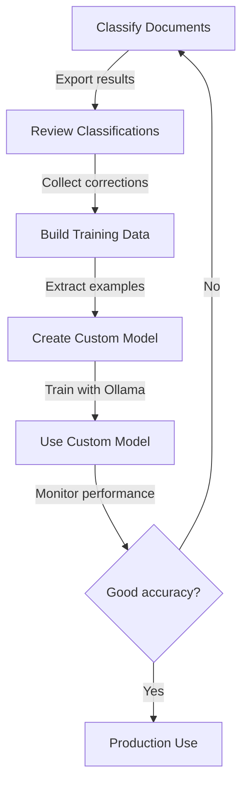

# Training Quick Start

Improve classification accuracy in 3 simple steps!

## Step 1: Classify & Export Results

```bash
# Classify documents and export results
doc-classify classify documents/input --export results.json
```

## Step 2: Review & Collect Training Data

```bash
# Review classifications and provide corrections
doc-classify review results.json
```

Interactive review:
```
Document 1/10
  File: invoice_123.pdf
  Predicted: reports
  Reasoning: Contains analysis...

  Correct category (or press Enter if correct): invoices
  ✓ Corrected to: invoices

...

Review Summary:
  Confirmed: 7
  Corrected: 3
  Total: 10

Training Data:
  Total examples: 10
  Accuracy: 70.00%
  Saved to: training_data.jsonl
```

## Step 3: Create Custom Model

```bash
# Export examples from training data
doc-classify export-examples

# Create Modelfile
doc-classify create-model --examples examples.json

# Create the model in Ollama
ollama create my-doc-classifier -f Modelfile

# Update your config to use the new model
echo "OLLAMA_MODEL=my-doc-classifier" >> .env
```

## Test Your Custom Model

```bash
# Classify with your new model
doc-classify classify documents/input

# Evaluate accuracy
doc-classify evaluate test_data/
```

## Complete Workflow



## Training Commands Summary

```bash
# Review and correct classifications
doc-classify review results.json [--output training_data.jsonl]

# Evaluate model accuracy
doc-classify evaluate test_data/ [--model MODEL_NAME]

# Export training examples
doc-classify export-examples [--training-data FILE] [--output examples.json]

# Create custom model
doc-classify create-model --examples examples.json [--model-name NAME]
```

## Example: Complete Training Session

```bash
# 1. Initial classification
doc-classify classify documents/input --export batch1.json

# 2. Review and correct
doc-classify review batch1.json
# (Review 50 documents, correct 10)

# 3. Classify more documents
doc-classify classify documents/batch2 --export batch2.json

# 4. Review again
doc-classify review batch2.json
# (Now have 100 training examples)

# 5. Export examples
doc-classify export-examples
# Output: examples.json with best examples per category

# 6. Create custom model
doc-classify create-model --examples examples.json --model-name my-classifier
# Output: Modelfile

# 7. Build the model
ollama create my-classifier -f Modelfile
# (Takes 1-5 minutes)

# 8. Test it
doc-classify check --model my-classifier
doc-classify classify test_doc.pdf

# 9. Evaluate performance
doc-classify evaluate test_data/ --model my-classifier
# Output: Accuracy: 95%!

# 10. Make it default
echo "OLLAMA_MODEL=my-classifier" >> .env
```

## Tips for Better Training

### 1. Quality over Quantity
- Start with 10-20 examples per category
- Ensure corrections are accurate
- Diverse document types help

### 2. Iterative Improvement
```bash
# Week 1: Collect 50 examples
doc-classify review batch1.json

# Week 2: Add 50 more
doc-classify review batch2.json

# Week 3: Create first model
doc-classify create-model --examples examples.json

# Week 4: Evaluate and iterate
doc-classify evaluate test_data/
```

### 3. Monitor Accuracy
```bash
# Regular evaluation
doc-classify evaluate test_data/ > eval_$(date +%Y%m%d).txt

# Compare results over time
grep "Overall Accuracy" eval_*.txt
```

## Troubleshooting

**Low accuracy after training?**
- Collect more examples (aim for 50+ per category)
- Review examples for quality
- Try a larger base model (llama3.1:8b)

**Model creation fails?**
- Check Ollama is running: `ollama serve`
- Verify base model exists: `ollama list`
- Check Modelfile syntax: `cat Modelfile`

**Training data not improving results?**
- Ensure examples are diverse
- Check for mislabeled data
- Consider prompt engineering first

## Next Steps

- Read [TRAINING_GUIDE.md](TRAINING_GUIDE.md) for detailed guide
- See [examples/sample_usage.py](examples/sample_usage.py) for Python API
- Check [README.md](README.md) for full documentation

---

**Remember:** Start simple, iterate often, monitor results!
